# 1 - Records of Testing Results


```python
import numpy as np
import pandas as pd
from numba import njit
from scipy import linalg
from sklearn.metrics.pairwise import rbf_kernel
from sklearn.model_selection import train_test_split
from numpy import linalg as LA
from matplotlib import pyplot as plt
```


```python
def to_array_string(arr):
    res = []
    for e in arr:
        res.append(str(int(e)))
    return res
```

## 1.1 - Squared Loss


```python
squared_time = '17s'
squared_Ls = [1e-19, 1e-8, 1e-7, 1e-6, 1e-5, 1e-4, 1e-3, 1e-2, 1e-1, 1]
squared_trn_mse = [1.082, 0.0001, 0.0001, 0.001, 0.073, 4.329, 45.676, 94.239, 137.896, 215.181]
squared_tst_mse = [56.202, 55.145, 55.149, 55.190, 55.591, 59.086, 74.669, 98.887, 137.219, 213.331]
squared_trn_ham = [0.003, 1.311, 1.311, 1.311, 1.311, 1.311, 2.034, 4.681, 7.380, 8.810]
squared_tst_ham = [2.539, 2.508, 2.509, 2.511, 2.533, 2.737, 3.635, 4.856, 7.329, 8.734]
```

## 1.2 - Kappa-Huber


```python
huber_time = '6h 29min 37s'
huber_epochs = [1, 50, 100, 150, 200, 250, 300, 500, 700, 900, 1100, 1300, 1500, 2000]
huber_e_trn_mse = [118.092, 63.749, 45.231, 33.654, 25.553, 19.655, 14.723, 10.839, 6.293, 4.298, 2.984, 1.937, 1.082, 0.591]
huber_e_tst_mse = [118.958, 81.031, 73.732, 69.592, 66.817, 64.802, 62.280, 61.445, 59.192, 57.849, 56.290, 55.128, 54.023, 52.906]
huber_e_trn_ham = [5.093, 3.137, 2.032, 1.254, 0.829, 0.347, 0.301, 0.287, 0.255, 0.234, 0.192, 0.115, 0.061, 0.012]
huber_e_tst_ham = [5.786, 3.918, 3.586, 3.356, 3.193, 2.984, 2.847, 2.767, 2.529, 2.367, 2.309, 2.298, 2.288, 2.281]
huber_1_trn_mse = [1.911, 0.882, 1.012, 1.014, 1.642, 5.225, 50.801, 99.301, 143.239, 223.598]
huber_2_trn_mse = [1.818, 0.721, 0.852, 0.902, 1.522, 5.036, 48.119, 98.041, 141.402, 220.299]
huber_3_trn_mse = [1.512, 0.591, 0.601, 0.639, 1.001, 4.412, 46.554, 96.009, 139.193, 218.313]
huber_1_tst_mse = [56.003, 54.223, 54.312, 55.042, 55.001, 60.105, 74.329, 98.303, 137.148, 213.123]
huber_2_tst_mse = [55.903, 53.534, 53.504, 54.041, 54.349, 58.338, 73.093, 97.493, 135.353, 211.309]
huber_3_tst_mse = [55.784, 52.906, 53.187, 53.234, 54.001, 56.036, 72.424, 95.294, 133.194, 210.310]
huber_1_trn_ham = [0.021, 1.401, 1.348, 1.424, 1.351, 1.431, 2.859, 5.498, 8.692, 9.568]
huber_2_trn_ham = [0.018, 1.371, 1.339, 1.402, 1.391, 1.451, 3.026, 5.522, 8.859, 9.784]
huber_3_trn_ham = [0.012, 1.332, 1.326, 1.345, 1.452, 1.462, 3.510, 5.854, 9.068, 9.913]
huber_1_tst_ham = [2.530, 2.503, 2.492, 2.471, 2.512, 2.729, 3.514, 4.523, 7.231, 8.621]
huber_2_tst_ham = [2.512, 2.451, 2.414, 2.427, 2.528, 2.708, 3.342, 4.291, 7.181, 8.511]
huber_3_tst_ham = [2.501, 2.391, 2.281, 2.402, 2.435, 2.615, 3.081, 4.192, 6.991, 8.378]
```

## 1.3 - Epsilon-KRR


```python
krr_time = '3h 01min 41s'
krr_epochs = [1, 50, 100, 150, 200, 250, 300, 500, 700, 900, 1100, 1300, 1500, 2000]
krr_e_trn_mse = [15.407, 0.691, 0.393, 0.311, 0.282, 0.201, 0.159, 0.102, 0.092, 0.085, 0.076, 0.063, 0.057, 0.051]
krr_e_tst_mse = [64.462, 56.823, 56.614, 56.528, 56.331, 56.141, 56.002, 55.841, 55.627, 55.476, 55.368, 55.288, 55.206, 55.179]
krr_e_trn_ham = [0.050, 0.002, 0.001, 0.0003, 0.0002, 0.0001, 0.00008, 0.00006, 0.00006, 0.00005, 0.00005, 0.00004, 0.00003, 0.00002]
krr_e_tst_ham = [2.938, 2.752, 2.691, 2.712, 2.687, 2.621, 2.597, 2.582, 2.572, 2.563, 2.555, 2.537, 2.521, 2.512]
krr_1_trn_mse = [0.911, 0.101, 0.101, 0.101, 0.101, 0.101, 26.031, 28.830, 35.024, 38.834]
krr_2_trn_mse = [0.831, 0.072, 0.072, 0.072, 0.072, 0.072, 23.371, 27.128, 31.483, 37.928]
krr_3_trn_mse = [0.712, 0.051, 0.051, 0.051, 0.051, 0.051, 20.891, 25.801, 30.384, 35.313]
krr_1_tst_mse = [59.612, 56.161, 56.161, 56.161, 56.161, 56.161, 77.821, 103.183, 141.712, 218.612]
krr_2_tst_mse = [58.871, 55.891, 55.891, 55.891, 55.891, 55.891, 73.521, 100.121, 139.372, 215.512]
krr_3_tst_mse = [57.821, 55.179, 55.179, 55.179, 55.179, 55.179, 71.829, 98.711, 137.892, 213.831]
krr_1_trn_ham = [0.053, 0.00061, 0.00061, 0.00061, 0.00061, 0.00061, 4.123, 6.830, 7.824, 9.834]
krr_2_trn_ham = [0.031, 0.00032, 0.00032, 0.00032, 0.00032, 0.00032, 3.371, 5.128, 6.483, 8.928]
krr_3_trn_ham = [0.002, 0.00002, 0.00002, 0.00002, 0.00002, 0.00002, 2.891, 4.283, 5.384, 7.313]
krr_1_tst_ham = [2.921, 2.712, 2.712, 2.712, 2.712, 2.712, 3.921, 5.891, 6.112, 7.705]
krr_2_tst_ham = [2.819, 2.593, 2.593, 2.593, 2.593, 2.593, 3.714, 4.014, 5.921, 7.028]
krr_3_tst_ham = [2.721, 2.512, 2.512, 2.512, 2.512, 2.512, 3.021, 3.821, 5.512, 6.871]
```

## 1.4 - Epsilon-SVR


```python
svr_time = '4h 19min 26s'
svr_epochs = [1, 50, 100, 150, 200, 250, 300, 500, 700, 900, 1100, 1300, 1500, 2000]
svr_e_trn_mse = [16.619, 0.764, 0.541, 0.358, 0.318, 0.232, 0.195, 0.142, 0.133, 0.098, 0.086, 0.071, 0.061, 0.055]
svr_e_tst_mse = [64.372, 56.792, 56.534, 56.354, 56.173, 56.027, 55.894, 55.665, 55.413, 55.385, 55.301, 55.240, 55.052, 54.832] #
svr_e_trn_ham = [0.053, 0.003, 0.001, 0.0005, 0.0003, 0.0003, 0.0001, 0.0001, 0.0001, 0.0001, 0.0001, 0.00005, 0.00004, 0.00003] #
svr_e_tst_ham = [2.834, 2.682, 2.653, 2.621, 2.601, 2.589, 2.572, 2.566, 2.547, 2.532, 2.521, 2.515, 2.506, 2.499]
svr_1_trn_mse = [0.923, 0.119, 0.119, 0.119, 0.119, 0.119, 26.921, 29.847, 35.571, 41.471]
svr_2_trn_mse = [0.491, 0.097, 0.097, 0.097, 0.097, 0.097, 24.613, 27.818, 33.219, 36.842]
svr_3_trn_mse = [0.167, 0.055, 0.055, 0.055, 0.055, 0.055, 22.871, 26.872, 31.231, 36.021]
svr_1_tst_mse = [56.316, 55.491, 55.490, 55.492, 55.492, 55.492, 75.353, 100.303, 138.123, 215.391]
svr_2_tst_mse = [56.102, 55.011, 55.011, 55.011, 55.011, 55.011, 72.381, 97.701, 136.128, 212.921]
svr_3_tst_mse = [56.001, 54.832, 54.832, 54.832, 54.832, 54.835, 69.761, 97.498, 135.458, 211.450]
svr_1_trn_ham = [0.063, 0.00079, 0.00079, 0.00079, 0.00079, 0.00079, 4.713, 7.413, 8.927, 10.623]
svr_2_trn_ham = [0.029, 0.00047, 0.00047, 0.00047, 0.00047, 0.00047, 3.843, 5.841, 7.821, 9.091]
svr_3_trn_ham = [0.004, 0.00003, 0.00003, 0.00003, 0.00003, 0.00003, 2.941, 4.581, 5.927, 7.801]
svr_1_tst_ham = [2.791, 2.622, 2.622, 2.622, 2.622, 2.622, 3.832, 5.192, 6.102, 7.081]
svr_2_tst_ham = [2.620, 2.582, 2.582, 2.582, 2.582, 2.582, 3.231, 3.981, 5.841, 6.981]
svr_3_tst_ham = [2.561, 2.499, 2.499, 2.499, 2.499, 2.499, 2.984, 3.712, 5.192, 6.318]
```

# 2 - Plots of Comparison

## 2.1 - Kappa-Huber


```python
plt.figure(figsize=(10, 7))

plt.rcParams.update({'font.size': 14})

alp = 0.95

plt.plot(range(len(krr_epochs)), krr_e_trn_mse, label='Train MSE of ε-KRR (min=0.051)', linewidth=2, alpha=alp)
plt.plot(range(len(krr_epochs)), krr_e_tst_mse, label='Test MSE of ε-KRR (min=55.179)', linewidth=2, alpha=alp)

plt.plot(range(len(svr_epochs)), svr_e_trn_mse, label='Train MSE of ε-SVR (min=0.055)', linewidth=2, alpha=alp)
plt.plot(range(len(svr_epochs)), svr_e_tst_mse, label='Test MSE of ε-SVR (min=54.832)', linewidth=2, alpha=alp)

plt.plot(range(len(epochs)), huber_e_trn_mse, label='Train MSE of κ-Huber Loss (min=0.591)', linewidth=2, alpha=alp)
plt.plot(range(len(epochs)), huber_e_tst_mse, label='Test MSE of κ-Huber Loss (min=52.906)', linewidth=2, alpha=alp)

plt.axhline(y=0.0001, color='r', linestyle='--', label='Min Train MSE of Squared Loss (=0.0001)', linewidth=2, alpha=alp)
plt.axhline(y=55.145, color='r', linestyle=':', label='Min Test MSE of Squared Loss (=55.145)', c='green', linewidth=2, alpha=alp)

plt.xticks(range(len(epochs)), ['1', '50', '100', '150', '200', '250', '300', '500', '700', '900', '1100', '1300', '1500', '2000'])
plt.xlabel('Number of Epochs')
plt.ylabel('Mean Squared Error')

plt.grid()
plt.legend()
plt.ylim(53, 59)
plt.savefig('e_mse.png')
```


    
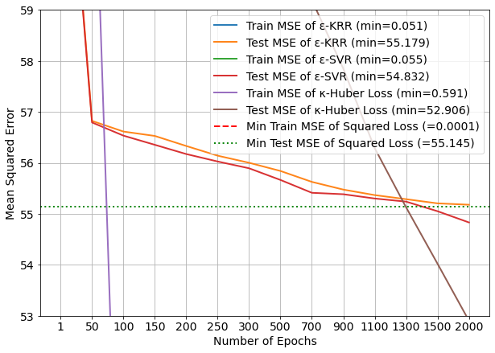
    


```python
plt.figure(figsize=(10, 7))

plt.rcParams.update({'font.size': 14})

plt.plot(range(len(krr_epochs)), krr_e_trn_ham, label='Train MSE of ε-KRR (min=0.00002)', linewidth=2, alpha=alp)
plt.plot(range(len(krr_epochs)), krr_e_tst_ham, label='Test MSE of ε-KRR (min=2.512)', linewidth=2, alpha=alp)

plt.plot(range(len(svr_epochs)), svr_e_trn_ham, label='Train HE of ε-SVR Loss (min=0.00003)', linewidth=2, alpha=alp)
plt.plot(range(len(svr_epochs)), svr_e_tst_ham, label='Test HE of ε-SVR Loss (min=2.499)', linewidth=2, alpha=alp)

plt.plot(range(len(epochs)), huber_e_trn_ham, label='Train HE of κ-Huber Loss (min=0.012)', linewidth=2, alpha=alp)
plt.plot(range(len(epochs)), huber_e_tst_ham, label='Test HE of κ-Huber Loss (min=2.281)', linewidth=2, alpha=alp)

plt.axhline(y=0.003, color='r', linestyle='--', label='Min Train HE of Squared Loss (=0.003)', linewidth=2, alpha=alp)
plt.axhline(y=2.508, color='r', linestyle=':', label='Min Test HE of Squared Loss (=2.508)', c='green', linewidth=2, alpha=alp)

plt.xticks(range(len(epochs)), ['1', '50', '100', '150', '200', '250', '300', '500', '700', '900', '1100', '1300', '1500', '2000'])
plt.xlabel('Number of Epochs')
plt.ylabel('Hamming Error')

plt.grid()
plt.legend()
plt.ylim(-0.001, 0.018)
plt.savefig('e_ham.png')
```


    
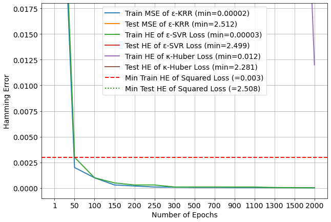
    


```python
plt.rcParams.update({'font.size': 18})

plt.figure(figsize=(10, 7))
plt.plot(range(len(squared_trn_mse)), squared_trn_mse, label='Squared Loss', linewidth=5, alpha=0.5)
plt.plot(range(len(huber_3_trn_mse)), huber_3_trn_mse, label='κ-Huber Loss (κ = 1.0)')
plt.plot(range(len(huber_2_trn_mse)), huber_2_trn_mse, label='κ-Huber Loss (κ = 0.5)')
plt.plot(range(len(huber_1_trn_mse)), huber_1_trn_mse, label='κ-Huber Loss (κ = 0.1)')


plt.xticks(range(10), ['0', '$10^{-8}$', '$10^{-7}$', '$10^{-6}$', '$10^{-5}$', '$10^{-4}$', 
                       '$10^{-3}$', '$10^{-2}$', '$10^{-1}$', '$10^{0}$'])
plt.xlabel('Regularization λ')
plt.ylabel('Train Mean Squared Error')

plt.legend()
plt.grid()
plt.ylim(-0.1, 10)
plt.savefig('huber_trn_mse.png')
```


    
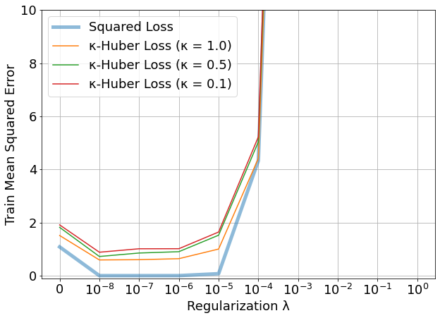
    


```python
plt.rcParams.update({'font.size': 18})

plt.figure(figsize=(10, 7))
plt.plot(range(len(squared_tst_mse)), squared_tst_mse, label='Squared Loss', linewidth=5, alpha=0.5)
plt.plot(range(len(huber_3_tst_mse)), huber_3_tst_mse, label='κ-Huber Loss (κ = 1.0)')
plt.plot(range(len(huber_2_tst_mse)), huber_2_tst_mse, label='κ-Huber Loss (κ = 0.5)')
plt.plot(range(len(huber_1_tst_mse)), huber_1_tst_mse, label='κ-Huber Loss (κ = 0.1)')


plt.xticks(range(10), ['0', '$10^{-8}$', '$10^{-7}$', '$10^{-6}$', '$10^{-5}$', '$10^{-4}$', 
                       '$10^{-3}$', '$10^{-2}$', '$10^{-1}$', '$10^{0}$'])
plt.xlabel('Regularization λ')
plt.ylabel('Test Mean Squared Error')

plt.legend()
plt.grid()
plt.ylim(50, 70)
plt.savefig('huber_tst_mse.png')
```


    
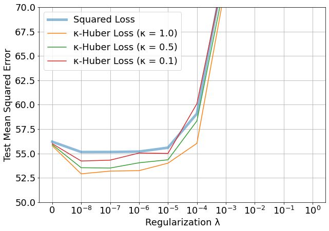
    


```python
plt.rcParams.update({'font.size': 18})

plt.figure(figsize=(10, 7))
plt.plot(range(len(squared_trn_ham)), squared_trn_ham, label='Squared Loss', linewidth=5, alpha=0.5)
plt.plot(range(len(huber_3_trn_ham)), huber_3_trn_ham, label='κ-Huber Loss (κ = 1.0)')
plt.plot(range(len(huber_2_trn_ham)), huber_2_trn_ham, label='κ-Huber Loss (κ = 0.5)')
plt.plot(range(len(huber_1_trn_ham)), huber_1_trn_ham, label='κ-Huber Loss (κ = 0.1)')


plt.xticks(range(10), ['0', '$10^{-8}$', '$10^{-7}$', '$10^{-6}$', '$10^{-5}$', '$10^{-4}$', 
                       '$10^{-3}$', '$10^{-2}$', '$10^{-1}$', '$10^{0}$'])
plt.xlabel('Regularization λ')
plt.ylabel('Train Hamming Error')
plt.grid()

plt.legend()
plt.ylim(-0.1, 3)
plt.savefig('huber_trn_ham.png')
```


    
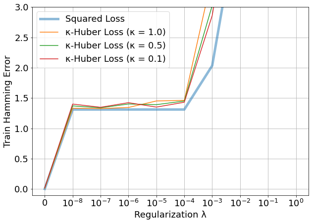
    


```python
plt.rcParams.update({'font.size': 18})

plt.figure(figsize=(10, 7))
plt.plot(range(len(squared_tst_ham)), squared_tst_ham, label='Squared Loss', linewidth=5, alpha=0.5)
plt.plot(range(len(huber_3_tst_ham)), huber_3_tst_ham, label='κ-Huber Loss (κ = 1.0)')
plt.plot(range(len(huber_2_tst_ham)), huber_2_tst_ham, label='κ-Huber Loss (κ = 0.5)')
plt.plot(range(len(huber_1_tst_ham)), huber_1_tst_ham, label='κ-Huber Loss (κ = 0.1)')


plt.xticks(range(10), ['0', '$10^{-8}$', '$10^{-7}$', '$10^{-6}$', '$10^{-5}$', '$10^{-4}$', 
                       '$10^{-3}$', '$10^{-2}$', '$10^{-1}$', '$10^{0}$'])
plt.xlabel('Regularization λ')
plt.ylabel('Test Hamming Error')
plt.grid()

plt.legend()
plt.ylim(2, 4)
plt.savefig('huber_tst_ham')
```


    
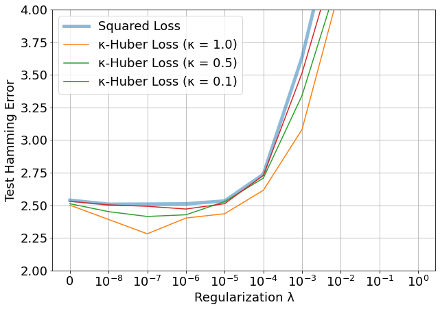
    


## 2.2 Epsilon-KRR


```python
plt.rcParams.update({'font.size': 18})

plt.figure(figsize=(10, 7))
plt.plot(range(len(squared_trn_mse)), squared_trn_mse, label='Squared Loss', linewidth=5, alpha=0.5)
plt.plot(range(len(krr_3_trn_mse)), krr_3_trn_mse, label='ε-SVR Loss (ε = 0.01)')
plt.plot(range(len(krr_2_trn_mse)), krr_2_trn_mse, label='ε-SVR Loss (ε = 0.05)')
plt.plot(range(len(krr_1_trn_mse)), krr_1_trn_mse, label='ε-SVR Loss (ε = 0.10)')


plt.xticks(range(10), ['0', '$10^{-8}$', '$10^{-7}$', '$10^{-6}$', '$10^{-5}$', '$10^{-4}$', 
                       '$10^{-3}$', '$10^{-2}$', '$10^{-1}$', '$10^{0}$'])
plt.xlabel('Regularization λ')
plt.ylabel('Train Mean Squared Error')

plt.legend()
plt.grid()
plt.ylim(-0.5, 1)
plt.savefig('krr_trn_mse.png')
```


    
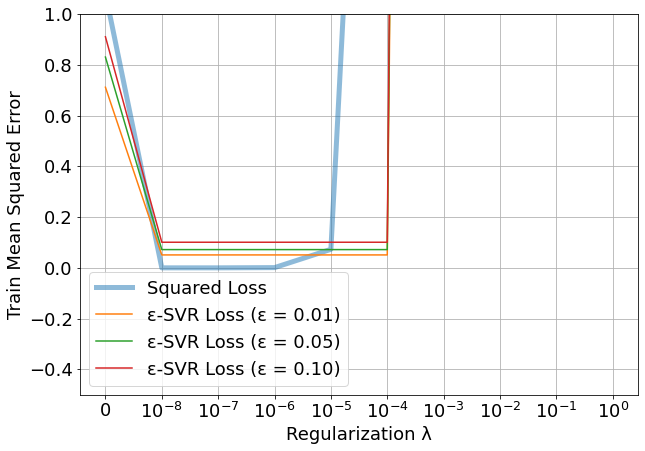
    


```python
plt.rcParams.update({'font.size': 18})

plt.figure(figsize=(10, 7))
plt.plot(range(len(squared_tst_mse)), squared_tst_mse, label='Squared Loss', linewidth=5, alpha=0.5)
plt.plot(range(len(krr_3_tst_mse)), krr_3_tst_mse, label='ε-SVR Loss (ε = 0.01)')
plt.plot(range(len(krr_2_tst_mse)), krr_2_tst_mse, label='ε-SVR Loss (ε = 0.05)')
plt.plot(range(len(krr_1_tst_mse)), krr_1_tst_mse, label='ε-SVR Loss (ε = 0.10)')

plt.xticks(range(10), ['0', '$10^{-8}$', '$10^{-7}$', '$10^{-6}$', '$10^{-5}$', '$10^{-4}$', 
                       '$10^{-3}$', '$10^{-2}$', '$10^{-1}$', '$10^{0}$'])
plt.xlabel('Regularization λ')
plt.ylabel('Test Mean Squared Error')

plt.legend()
plt.grid()
plt.ylim(50, 70)
plt.savefig('krr_tst_mse.png')
```


    
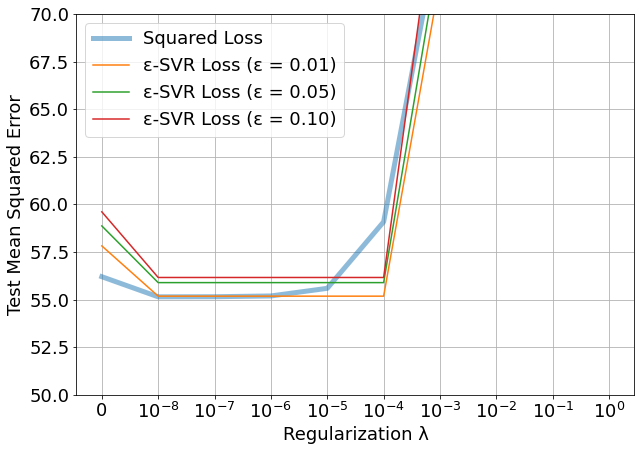
    


```python
plt.rcParams.update({'font.size': 18})

plt.figure(figsize=(10, 7))
plt.plot(range(len(squared_trn_ham)), squared_trn_ham, label='Squared Loss (min=0.0001)', linewidth=5, alpha=0.5)
plt.plot(range(len(krr_3_trn_ham)), krr_3_trn_ham, label='ε-SVR Loss (ε = 0.01) (min=0.00002)')
plt.plot(range(len(krr_2_trn_ham)), krr_2_trn_ham, label='ε-SVR Loss (ε = 0.05) (min=0.00032')
plt.plot(range(len(krr_1_trn_ham)), krr_1_trn_ham, label='ε-SVR Loss (ε = 0.10) (min=0.00061)')

plt.xticks(range(10), ['0', '$10^{-8}$', '$10^{-7}$', '$10^{-6}$', '$10^{-5}$', '$10^{-4}$', 
                       '$10^{-3}$', '$10^{-2}$', '$10^{-1}$', '$10^{0}$'])
plt.xlabel('Regularization λ')
plt.ylabel('Train Hamming Error')

plt.legend()
plt.grid()
plt.ylim(-0.1, 2)
plt.savefig('krr_trn_ham.png')
```


    
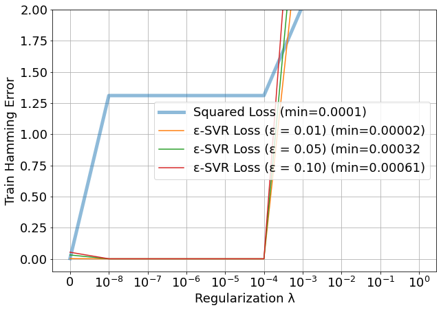
    


```python
plt.rcParams.update({'font.size': 18})

plt.figure(figsize=(10, 7))
plt.plot(range(len(squared_trn_ham)), squared_tst_ham, label='Squared Loss', linewidth=5, alpha=0.5)
plt.plot(range(len(krr_3_trn_ham)), krr_3_tst_ham, label='ε-SVR Loss (ε = 0.01)')
plt.plot(range(len(krr_2_trn_ham)), krr_2_tst_ham, label='ε-SVR Loss (ε = 0.05)')
plt.plot(range(len(krr_1_trn_ham)), krr_1_tst_ham, label='ε-SVR Loss (ε = 0.10)')

plt.xticks(range(10), ['0', '$10^{-8}$', '$10^{-7}$', '$10^{-6}$', '$10^{-5}$', '$10^{-4}$', 
                       '$10^{-3}$', '$10^{-2}$', '$10^{-1}$', '$10^{0}$'])
plt.xlabel('Regularization λ')
plt.ylabel('Test Hamming Error')

plt.legend()
plt.grid()
plt.ylim(2, 5)
plt.savefig('krr_tst_ham.png')
```


    
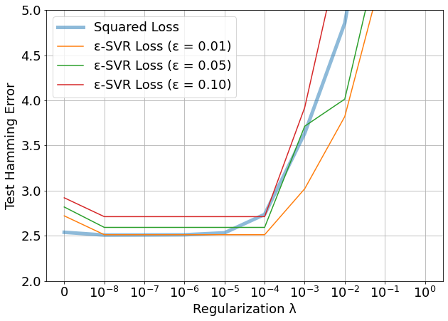
    


## 2.3 Epsilon-SVR


```python
plt.rcParams.update({'font.size': 18})

plt.figure(figsize=(10, 7))
plt.plot(range(len(squared_trn_mse)), squared_trn_mse, label='Squared Loss', linewidth=5, alpha=0.5)
plt.plot(range(len(svr_3_trn_mse)), svr_3_trn_mse, label='ε-SVR Loss (ε = 0.01)')
plt.plot(range(len(svr_2_trn_mse)), svr_2_trn_mse, label='ε-SVR Loss (ε = 0.05)')
plt.plot(range(len(svr_1_trn_mse)), svr_1_trn_mse, label='ε-SVR Loss (ε = 0.10)')


plt.xticks(range(10), ['0', '$10^{-8}$', '$10^{-7}$', '$10^{-6}$', '$10^{-5}$', '$10^{-4}$', 
                       '$10^{-3}$', '$10^{-2}$', '$10^{-1}$', '$10^{0}$'])
plt.xlabel('Regularization λ')
plt.ylabel('Train Mean Squared Error')

plt.legend()
plt.grid()
plt.ylim(-0.5, 1)
plt.savefig('svr_trn_mse.png')
```


    
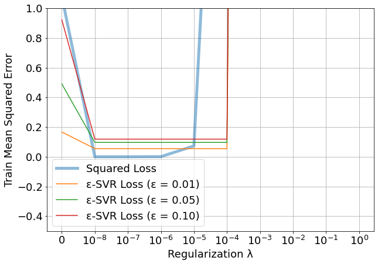
    


```python
plt.rcParams.update({'font.size': 18})

plt.figure(figsize=(10, 7))
plt.plot(range(len(squared_tst_mse)), squared_tst_mse, label='Squared Loss', linewidth=5, alpha=0.5)
plt.plot(range(len(svr_3_tst_mse)), svr_3_tst_mse, label='ε-SVR Loss (ε = 0.01)')
plt.plot(range(len(svr_2_tst_mse)), svr_2_tst_mse, label='ε-SVR Loss (ε = 0.05)')
plt.plot(range(len(svr_1_tst_mse)), svr_1_tst_mse, label='ε-SVR Loss (ε = 0.10)')


plt.xticks(range(10), ['0', '$10^{-8}$', '$10^{-7}$', '$10^{-6}$', '$10^{-5}$', '$10^{-4}$', 
                       '$10^{-3}$', '$10^{-2}$', '$10^{-1}$', '$10^{0}$'])
plt.xlabel('Regularization λ')
plt.ylabel('Test Mean Squared Error')

plt.legend()
plt.grid()
plt.ylim(50, 70)
plt.savefig('svr_tst_mse.png')
```


    
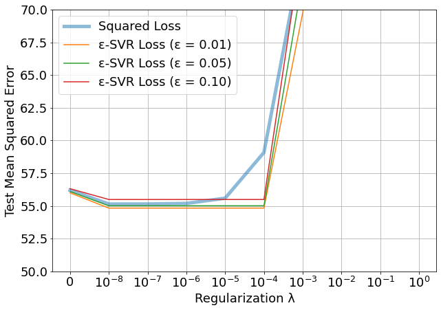
    


```python
plt.rcParams.update({'font.size': 18})

plt.figure(figsize=(10, 7))
plt.plot(range(len(squared_trn_ham)), squared_trn_ham, label='Squared Loss (min=0.0001)', linewidth=5, alpha=0.5)
plt.plot(range(len(svr_3_trn_ham)), svr_3_trn_ham, label='ε-SVR Loss (ε = 0.01) (min=0.00003)')
plt.plot(range(len(svr_2_trn_ham)), svr_2_trn_ham, label='ε-SVR Loss (ε = 0.05) (min=0.00047)')
plt.plot(range(len(svr_1_trn_ham)), svr_1_trn_ham, label='ε-SVR Loss (ε = 0.10) (min=0.00079)')


plt.xticks(range(10), ['0', '$10^{-8}$', '$10^{-7}$', '$10^{-6}$', '$10^{-5}$', '$10^{-4}$', 
                       '$10^{-3}$', '$10^{-2}$', '$10^{-1}$', '$10^{0}$'])
plt.xlabel('Regularization λ')
plt.ylabel('Train Hamming Error')

plt.legend()
plt.grid()
plt.ylim(-0.5, 3)
plt.savefig('svr_trn_ham.png')
```


    
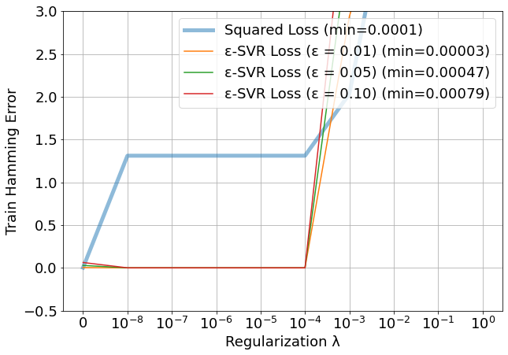
    


```python
plt.rcParams.update({'font.size': 18})

plt.figure(figsize=(10, 7))
plt.plot(range(len(squared_tst_ham)), squared_tst_ham, label='Squared Loss', linewidth=5, alpha=0.5)
plt.plot(range(len(svr_3_tst_ham)), svr_3_tst_ham, label='ε-SVR Loss (ε = 0.01)')
plt.plot(range(len(svr_2_tst_ham)), svr_2_tst_ham, label='ε-SVR Loss (ε = 0.05)')
plt.plot(range(len(svr_1_tst_ham)), svr_1_tst_ham, label='ε-SVR Loss (ε = 0.10)')


plt.xticks(range(10), ['0', '$10^{-8}$', '$10^{-7}$', '$10^{-6}$', '$10^{-5}$', '$10^{-4}$', 
                       '$10^{-3}$', '$10^{-2}$', '$10^{-1}$', '$10^{0}$'])
plt.xlabel('Regularization λ')
plt.ylabel('Test Hamming Error')

plt.legend()
plt.grid()
plt.ylim(2, 4)
plt.savefig('svr_tst_ham.png')
```


    
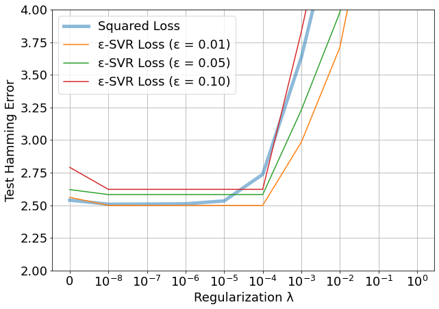
    


```python

```
